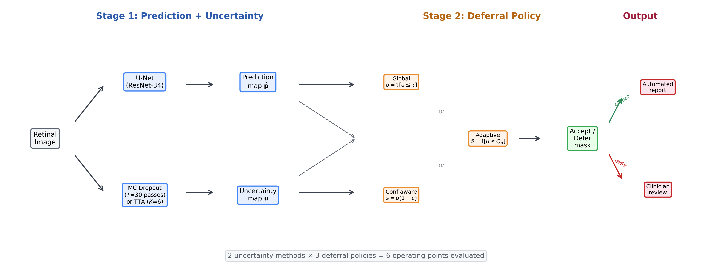
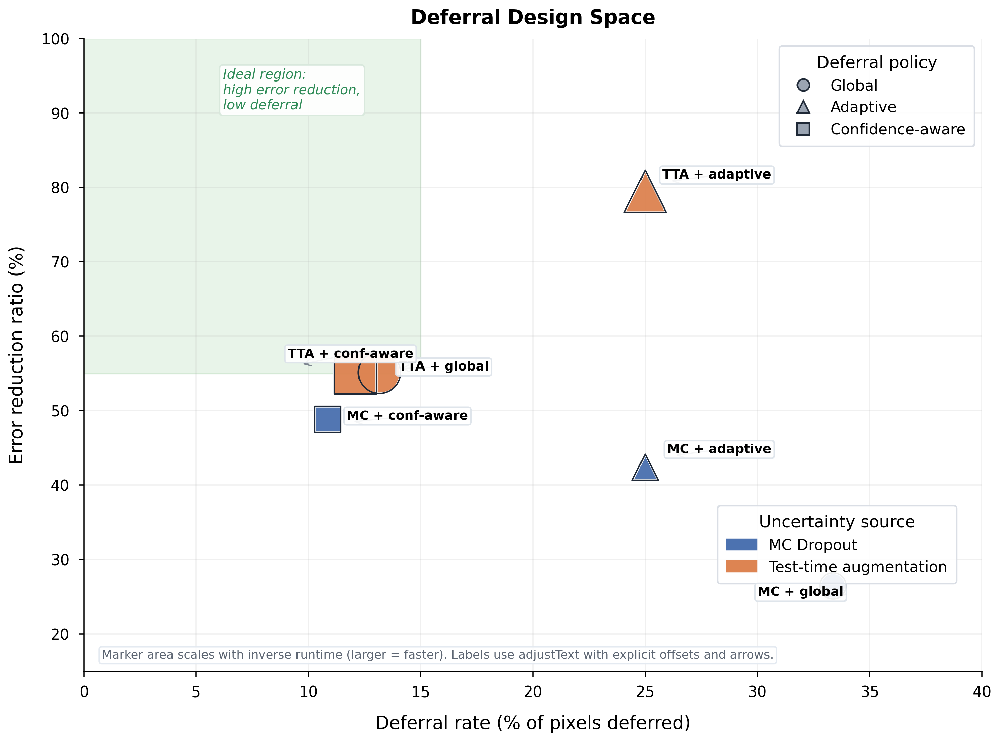
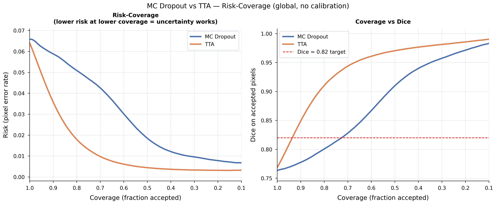
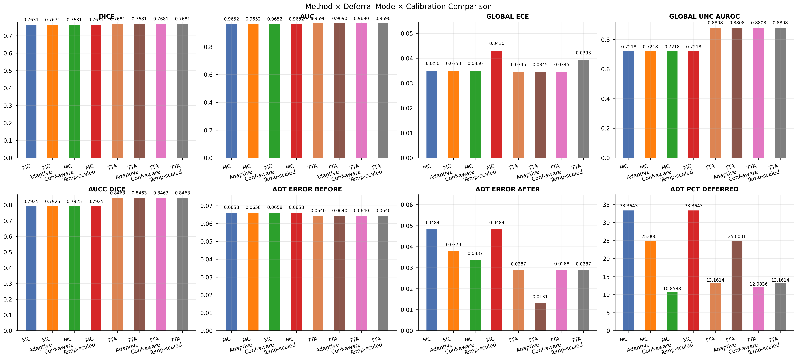
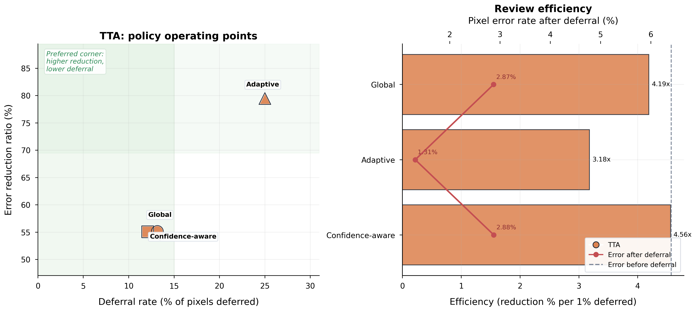
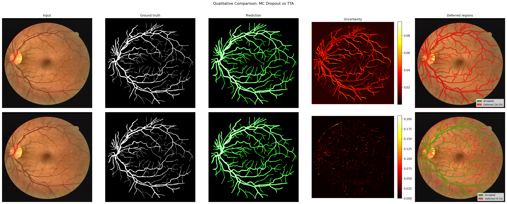
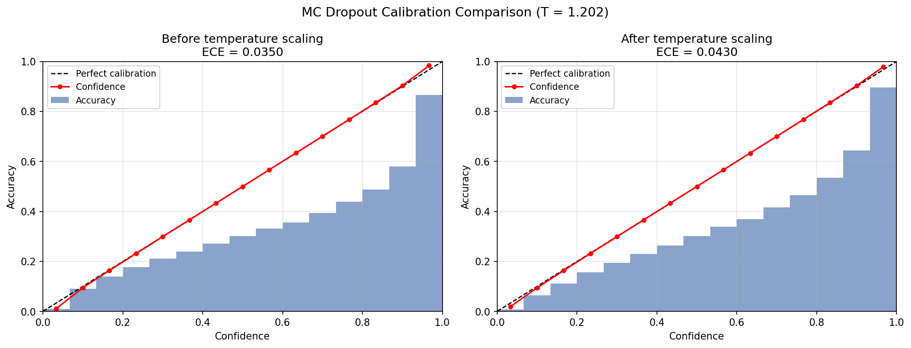
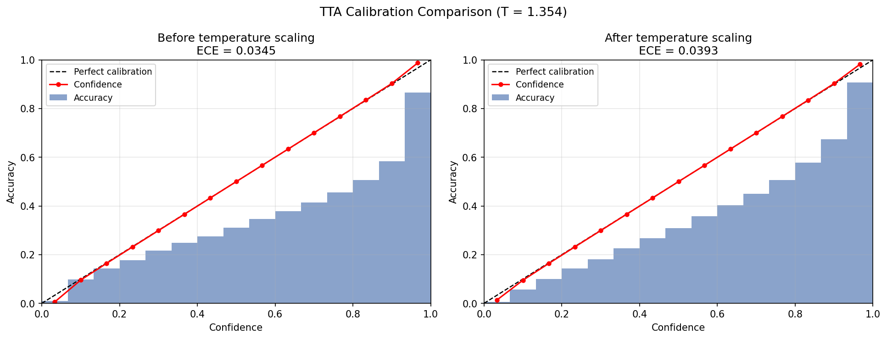

# From Prediction to Decision: Uncertainty-Aware Deferral for Reliable Medical Image Segmentation


Reliable segmentation is not only about predicting masks well.
It is about knowing when the model should decide automatically and when it should defer for review.

This repository also ships a full paper package and project page:

- arXiv source: `arxiv_submission/`
- compiled paper PDF: `arxiv_submission/main.pdf`
- project website: `project_page/index.html`
- publication figures: `paper/figures/`
- web-ready figures: `project_page/assets/`

---

## Table of Contents

- [1. Overview](#1-overview)
- [2. Tagline](#2-tagline)
- [3. Executive Summary](#3-executive-summary)
- [4. Why This Repository Exists](#4-why-this-repository-exists)
- [5. Research Questions](#5-research-questions)
- [6. Key Contributions](#6-key-contributions)
- [7. Repository Scope](#7-repository-scope)
- [8. Project Snapshot](#8-project-snapshot)
- [9. Core Pipeline](#9-core-pipeline)
- [10. Model Architecture](#10-model-architecture)
- [11. Training Strategy](#11-training-strategy)
- [12. Uncertainty Estimation](#12-uncertainty-estimation)
- [13. Deferral Strategies](#13-deferral-strategies)
- [14. Calibration](#14-calibration)
- [15. Mathematical Intuition](#15-mathematical-intuition)
- [16. Experimental Setup](#16-experimental-setup)
- [17. Datasets](#17-datasets)
- [18. Preprocessing and Augmentation](#18-preprocessing-and-augmentation)
- [19. Evaluation Protocol](#19-evaluation-protocol)
- [20. Metrics](#20-metrics)
- [21. Main Results](#21-main-results)
- [22. Interpretation of Main Results](#22-interpretation-of-main-results)
- [23. Risk-Coverage Analysis](#23-risk-coverage-analysis)
- [24. Deferral Analysis](#24-deferral-analysis)
- [25. Calibration Findings](#25-calibration-findings)
- [26. Cross-Dataset Findings](#26-cross-dataset-findings)
- [27. Ablation Findings](#27-ablation-findings)
- [28. Visual Results](#28-visual-results)
- [29. Installation](#29-installation)
- [30. Dependency Notes](#30-dependency-notes)
- [31. Dataset Preparation](#31-dataset-preparation)
- [32. Quick Start](#32-quick-start)
- [33. Full Usage Guide](#33-full-usage-guide)
- [34. Command Reference](#34-command-reference)
- [35. Recommended Reproduction Paths](#35-recommended-reproduction-paths)
- [36. Project Structure](#36-project-structure)
- [37. File-by-File Guide](#37-file-by-file-guide)
- [38. Result Artifact Guide](#38-result-artifact-guide)
- [39. Reproducibility Checklist](#39-reproducibility-checklist)
- [40. Performance Benchmarks](#40-performance-benchmarks)
- [41. Limitations](#41-limitations)
- [42. Future Work](#42-future-work)
- [43. Citation](#43-citation)
- [44. Authors and Links](#44-authors-and-links)
- [45. FAQ](#45-faq)
- [46. Glossary](#46-glossary)
- [47. Figure Inventory](#47-figure-inventory)
- [48. Output Schema Notes](#48-output-schema-notes)
- [49. Closing Notes](#49-closing-notes)

---

## 1. Overview

This repository is a research codebase for retinal vessel segmentation with uncertainty-aware decision making.

The project does not stop at segmentation quality.

It studies how to turn segmentation uncertainty into actionable review policies.

The central framing is:

- predict a segmentation mask,
- estimate uncertainty over that prediction,
- decide whether the prediction should be accepted or deferred.

The repository contains:

- model definitions,
- training scripts,
- evaluation scripts,
- comparison pipelines,
- calibration code,
- selective prediction utilities,
- deferral utilities,
- result summaries,
- result plots,
- manuscript sources,
- arXiv packaging assets.

The core research message is simple:

> uncertainty is most useful when it is evaluated by the decisions it enables.

This project implements that message concretely for retinal vessel segmentation on DRIVE, STARE, and CHASE_DB1.

---

## 2. Tagline

From segmentation accuracy to deployment-aware reliability:
estimate uncertainty, rank risk, and defer the right pixels.

---

## 3. Executive Summary

This project studies binary retinal vessel segmentation using a U-Net-style architecture with uncertainty estimation and downstream decision rules.

The model family is evaluated not only for standard segmentation metrics such as Dice and AUC, but also for:

- expected calibration error,
- uncertainty AUROC,
- risk-coverage behavior,
- error reduction after deferral,
- cross-dataset robustness under distribution shift.

Two uncertainty sources are compared:

- Monte Carlo Dropout,
- Test-Time Augmentation.

Three decision policies are compared:

- global uncertainty thresholding,
- image-adaptive thresholding,
- confidence-aware deferral.

The strongest result shipped in this repository is:

- TTA with adaptive deferral reduces mean segmentation error by about `79.5%` while deferring `25.0%` of pixels.

The strongest low-budget operating point is:

- TTA with confidence-aware deferral removes about `55.1%` of error while deferring only `12.1%` of pixels.

The main comparison insight is:

- TTA produces materially stronger uncertainty than MC Dropout for this task,
- and that stronger uncertainty translates directly into better deferral and selective prediction behavior.

The project also shows that:

- calibration changes the reported ECE values,
- but those changes do not necessarily improve deferral quality or downstream operating points.

That is an important practical distinction.

Probability calibration and decision utility are related, but not identical.

---

## 4. Why This Repository Exists

Many segmentation repositories end at a test-set Dice score.

For medical deployment, that is not enough.

A model can be good on average and still unreliable at clinically important failure cases.

This repository exists to support a more deployment-oriented evaluation style.

Instead of only asking:

- how well does the model segment?

it also asks:

- where is the model uncertain?
- does uncertainty correlate with actual error?
- can uncertainty identify which pixels should be reviewed?
- which uncertainty source leads to the best downstream decisions?
- does uncertainty quality remain useful out of domain?

This repository is therefore both:

- a research artifact,
- and a practical reference for building abstention-aware segmentation systems.

---

## 5. Research Questions

The codebase is organized around a set of concrete research questions.

### 5.1 Primary questions

- Can a U-Net with dropout-based stochastic inference produce competitive vessel segmentation on DRIVE?
- Is MC Dropout uncertainty useful as a predictor of segmentation failure?
- Does TTA provide better uncertainty than MC Dropout for this task?
- How much segmentation error can be eliminated by deferring uncertain pixels?
- Which deferral strategy is best under different review budgets?

### 5.2 Secondary questions

- Does post-hoc temperature scaling improve uncertainty-guided decisions?
- Does uncertainty quality transfer to STARE and CHASE_DB1 without fine-tuning?
- How sensitive are conclusions to the number of MC passes?
- How sensitive are conclusions to patch size and dropout probability?
- How competitive is a deep ensemble relative to MC Dropout and TTA?

### 5.3 Deployment questions

- What is the most efficient operating point for low review budgets?
- What is the best method if runtime matters?
- What configuration best balances segmentation quality, uncertainty quality, and latency?

---

## 6. Key Contributions

- Frames medical image segmentation as a prediction-to-decision pipeline rather than a pure mask prediction task.
- Implements a unified evaluation framework spanning segmentation, uncertainty, calibration, selective prediction, and deferral.
- Compares MC Dropout and TTA as uncertainty estimators under the same downstream decision metrics.
- Evaluates three practical deferral rules with different operational behavior.
- Shows that TTA yields stronger uncertainty quality than MC Dropout on retinal vessel segmentation.
- Demonstrates that explicit deferral can remove the majority of segmentation errors at moderate review cost.
- Shows that confidence-aware deferral is especially effective at low review budgets.
- Verifies that calibration metrics alone are not sufficient to choose an uncertainty method for decision making.
- Includes cross-dataset evaluation on STARE and CHASE_DB1.
- Ships result artifacts, paper assets, and reproducibility-oriented summaries in the repository.

---

## 7. Repository Scope

This repository includes:

- research code,
- generated result artifacts,
- figures,
- summary tables,
- manuscript sources,
- project website assets,
- arXiv packaging assets.

This repository does not currently include:

- a license file,
- guaranteed dataset binaries,
- guaranteed checkpoint binaries for every historical experiment.

Where a public artifact is absent, the README explains the expected directory layout and reproduction path.

---

## 8. Project Snapshot

### 8.1 Problem setting

- Task: retinal vessel segmentation.
- Prediction granularity: pixel-level binary segmentation.
- Reliability granularity: pixel-level uncertainty and pixel-level deferral.
- In-domain benchmark: DRIVE.
- Out-of-domain benchmarks: STARE and CHASE_DB1.

### 8.2 Core method stack

- Segmentation model: U-Net.
- Encoder: ResNet backbone.
- Uncertainty sources: MC Dropout, TTA.
- Decision layer: global, adaptive, and confidence-aware deferral.
- Calibration: temperature scaling.

### 8.3 Main outputs

- `Dice`
- `AUC`
- `IoU`
- `ECE`
- `uncertainty AUROC`
- `risk-coverage curves`
- `coverage-vs-Dice curves`
- `deferral sweep summaries`
- `qualitative deferral visualizations`
- `cross-dataset summaries`
- `ablation summaries`

### 8.4 Main headline result

- TTA + adaptive deferral: about `79.4%` error reduction at `25.0%` deferred pixels.

---

## 9. Core Pipeline

The repository’s conceptual pipeline has three stages.

### 9.1 Stage 1: segmentation prediction

The model receives a retinal fundus image and produces a vessel probability map.

### 9.2 Stage 2: uncertainty estimation

The same image is re-evaluated under either:

- stochastic dropout passes,
- or deterministic test-time augmentations.

Variance or disagreement across predictions becomes the uncertainty map.

### 9.3 Stage 3: deferral decision

The uncertainty map is transformed into an accept/defer decision.

Pixels judged sufficiently reliable are accepted automatically.

Pixels judged risky are deferred for review.

### 9.4 Why this matters

Segmentation accuracy alone answers:

- what mask did the model predict?

The decision layer answers:

- what should we do with that prediction?

That is the central scientific and practical distinction of the project.

---

## 10. Model Architecture

### 10.1 Main segmentation model

The primary model is `MCDropoutUNet` implemented in `models/unet_mc.py`.

It wraps `segmentation_models_pytorch.Unet`.

### 10.2 Architectural components

- input channels: `3`
- output channels: `1`
- architecture family: U-Net
- encoder: configurable, defaulting to `resnet34` or `resnet50` depending on script
- encoder weights: ImageNet pretrained when using SMP defaults
- segmentation head: single-channel logit map
- decoder batch normalization: enabled

### 10.3 Dropout placement

The model applies dropout after decoder feature extraction and before the final segmentation head.

That choice matters because:

- it preserves a clean segmentation backbone,
- it makes stochasticity explicit,
- it keeps MC inference localized to the late feature representation.

### 10.4 MC behavior

At training time:

- dropout is active in the usual way.

At MC inference time:

- the model sets `_mc_active = True`,
- and forces dropout during forward passes even in evaluation mode.

### 10.5 Why this design is practical

This architecture keeps the code simple.

It does not require:

- variational layers everywhere,
- architectural branching,
- auxiliary uncertainty heads,
- specialized Bayesian layers.

The same base network supports:

- deterministic inference,
- MC Dropout inference,
- TTA inference.

### 10.6 Deep ensemble support

The repository also defines a `DeepEnsemble` wrapper in `models/unet_mc.py`.

In practice, ensemble evaluation is handled by loading multiple `ensemble_*` checkpoints and averaging their outputs.

---

## 11. Training Strategy

### 11.1 Base training path

The main training entry point is `train.py`.

Key training features include:

- seed control,
- checkpoint saving,
- early stopping,
- learning rate scheduling,
- gradient clipping,
- patch and full-image modes,
- multiple loss choices.

### 11.2 Optimization

- optimizer: `AdamW`
- scheduler: `ReduceLROnPlateau`
- gradient clipping: norm `1.0`
- early stopping: enabled

### 11.3 Loss support

The training code exposes multiple loss-related arguments:

- `focal_tversky`
- `dice_bce`
- weighted BCE-style settings

The repository defaults emphasize class imbalance handling, which is important because vessel pixels are sparse.

### 11.4 Sampling strategy

The code supports:

- patch-based training,
- vessel-aware patch sampling,
- minimum vessel pixel constraints,
- vessel sampling probability control.

This is important because many naive random crops contain mostly background.

### 11.5 Full-image fine-tuning

The cross-validation pipeline explicitly supports:

- patch warm-up,
- followed by full-image fine-tuning.

This mirrors a sensible staged training recipe:

- patches improve sample efficiency,
- full-image fine-tuning improves final spatial consistency.

---

## 12. Uncertainty Estimation

### 12.1 MC Dropout

MC Dropout estimates predictive uncertainty by running multiple stochastic forward passes through the same network.

Repository behavior:

- enable dropout at test time,
- collect `T` predictions,
- compute mean prediction,
- compute variance map,
- optionally compute mutual-information-style downstream analysis.

Typical inference setting in the repository:

- `n_passes = 30`

### 12.2 TTA

TTA estimates uncertainty by applying deterministic transforms that should preserve semantics.

Implemented transforms in `models/tta.py` include:

- identity,
- horizontal flip,
- vertical flip,
- rotation 90 degrees,
- rotation 180 degrees,
- rotation 270 degrees.

The wrapper:

- transforms the image,
- predicts on each transformed view,
- inversely maps predictions back to the original orientation,
- stacks all predictions,
- computes mean and variance.

### 12.3 Practical difference between MC Dropout and TTA

MC Dropout probes:

- sensitivity to stochastic weight-level perturbation.

TTA probes:

- sensitivity to geometric input perturbation.

For thin retinal vessels and boundary regions, TTA is especially well matched to the failure modes because:

- small geometric changes can expose instability exactly where segmentation is fragile.

### 12.4 What uncertainty map quality means here

In this repository, uncertainty is considered useful when:

- high-uncertainty pixels are disproportionately error-prone,
- removing or deferring those pixels improves accepted-region quality quickly,
- uncertainty ranking yields strong risk-coverage behavior.

That is why `Unc-AUROC`, `AUCC`, and deferral results matter more than uncertainty magnitude alone.

---

## 13. Deferral Strategies

The project implements three deferral modes.

### 13.1 Global deferral

Global deferral learns a single threshold over uncertainty.

A pixel is deferred if:

- its uncertainty exceeds the learned global threshold.

Strengths:

- simple,
- easy to communicate,
- easy to deploy.

Weaknesses:

- one threshold must fit every image,
- easy images may consume too little budget,
- hard images may consume too much budget.

### 13.2 Adaptive deferral

Adaptive deferral uses a per-image percentile threshold.

A common setting in the repository is:

- defer the top `25%` most uncertain pixels per image.

Strengths:

- normalizes across image difficulty,
- allocates review budget per image,
- often improves error removal at moderate deferral rates.

Weaknesses:

- forces a fixed fraction per image even if image difficulty differs substantially.

### 13.3 Confidence-aware deferral

Confidence-aware deferral combines:

- uncertainty,
- and proximity to the decision boundary.

The practical intuition is:

- defer pixels that are both uncertain and borderline.

This suppresses:

- uncertain-but-confident pixels,
- which might otherwise waste review budget.

Strengths:

- highly efficient at small review budgets,
- better low-budget operating point in the shipped results.

Weaknesses:

- slightly more complex to explain than plain thresholding.

### 13.4 Why three modes matter

These modes expose a meaningful design space:

- global: simplest,
- adaptive: strongest at moderate deferral budgets,
- confidence-aware: strongest efficiency at low budgets.

---

## 14. Calibration

The repository includes post-hoc temperature scaling in `utils/calibration.py`.

### 14.1 What temperature scaling does

It learns a scalar `T` and rescales logits by:

```text
logit / T
```

before applying sigmoid.

Interpretation:

- `T > 1` softens probabilities,
- `T < 1` sharpens probabilities.

### 14.2 Why calibration is included

Calibration is a standard baseline in uncertainty work.

A calibrated model is expected to align confidence with observed accuracy.

### 14.3 Why calibration is not the whole story

This repository explicitly tests whether calibration improves:

- selective prediction,
- deferral quality,
- uncertainty-error ranking.

The answer in the main comparison artifacts is:

- not materially,
- and sometimes negatively for decision quality.

### 14.4 Practical conclusion

Calibration can change reported confidence behavior.

It should not automatically be assumed to improve uncertainty-guided decisions.

---

## 15. Mathematical Intuition

This section gives a light, deployment-oriented interpretation rather than a formal proof-heavy treatment.

### 15.1 Segmentation output

For each pixel `(i, j)`, the network predicts:

- a probability `p_ij` that the pixel belongs to a vessel.

Binary segmentation uses:

- `p_ij > threshold`

to convert probabilities into a mask.

### 15.2 Uncertainty from repeated predictions

If repeated predictions disagree, uncertainty is high.

That disagreement can come from:

- dropout sampling,
- or augmentation-based prediction instability.

If repeated predictions agree strongly, uncertainty is low.

### 15.3 Error detection as ranking

Useful uncertainty is not only about scale.

It is about order.

If the most uncertain pixels are the ones most likely to be wrong, then uncertainty is useful for downstream action.

That is exactly what `Unc-AUROC` measures.

### 15.4 Selective prediction intuition

Suppose we sort pixels from:

- most certain,
- to least certain.

If we accept only the most certain pixels, accepted-region quality should increase.

A strong uncertainty estimator yields:

- faster quality improvement as coverage drops.

That is why risk-coverage curves are informative.

### 15.5 Deferral intuition

Deferral asks:

- which predictions should be reviewed instead of trusted automatically?

If the deferred set contains many errors and few correct predictions, the policy is efficient.

### 15.6 Confidence-aware intuition

Not all uncertain pixels are equally problematic.

A pixel can have moderate uncertainty while still being far from the decision boundary.

Confidence-aware deferral filters for pixels that are:

- uncertain,
- and not strongly committed to either class.

### 15.7 Calibration intuition

ECE measures whether probabilities and observed accuracy align on average across bins.

Deferral quality measures whether uncertainty ranks mistakes effectively.

Those are related but different goals.

That difference explains why calibration can change ECE without improving deferral.

---

## 16. Experimental Setup

The manuscript source in `paper/sections/experimental_setup.tex` provides the canonical setup summary.

This README restates and operationalizes it for reproducibility.

### 16.1 Dataset family

- `DRIVE`: in-domain benchmark
- `STARE`: external transfer benchmark
- `CHASE_DB1`: second external transfer benchmark

### 16.2 Image resolution handling

All images are resized to:

- `512 x 512`

for both training and evaluation.

### 16.3 Training crop behavior

Patch-based training uses:

- patch size: typically `256` or `384`,
- vessel-aware sampling,
- multiple patches per image,
- vessel presence constraints.

### 16.4 Inference behavior

Evaluation uses:

- full resized images,
- no patch tiling in the main evaluation path,
- batch size `1` in most uncertainty scripts.

### 16.5 Validation use

Validation predictions are used for:

- threshold selection,
- adaptive deferral fitting,
- confidence-aware deferral fitting,
- temperature scaling estimation.

### 16.6 Evaluation scope

The repository reports:

- segmentation metrics,
- uncertainty metrics,
- calibration metrics,
- selective prediction metrics,
- deferral metrics,
- runtime summaries.

---

## 17. Datasets

### 17.1 DRIVE

DRIVE is the main in-domain benchmark.

It contains:

- `40` fundus images,
- a standard `20/20` train/test split,
- binary vessel annotations.

Repository usage:

- training,
- validation,
- main test reporting.

### 17.2 STARE

STARE is used as a zero-shot external benchmark.

Repository usage:

- no fine-tuning,
- evaluate uncertainty transfer and decision transfer.

### 17.3 CHASE_DB1

CHASE_DB1 is the second external benchmark.

Repository usage:

- no fine-tuning,
- evaluate robustness under different acquisition conditions and population.

### 17.4 Why these datasets are useful together

The trio supports three questions:

- can the model segment the main benchmark well?
- does uncertainty remain useful out of domain?
- does reliability degrade more slowly than raw segmentation quality?

---

## 18. Preprocessing and Augmentation

### 18.1 Shared preprocessing assumptions

- images are resized,
- masks are aligned to the resized image geometry,
- field-of-view masks are respected during metric calculation.

### 18.2 Patch sampling behavior

Patch training is important because vessel pixels are sparse.

The code therefore supports:

- minimum vessel pixel constraints,
- vessel sampling probability,
- patch count per image per epoch.

### 18.3 Training-time augmentation

The experimental setup section reports:

- flips,
- small rotations,
- brightness and contrast perturbations.

### 18.4 Test-time augmentation

TTA uses geometric transforms only.

This matters because:

- they are label-preserving,
- they probe orientation and local structure sensitivity,
- they are easy to invert reliably.

---

## 19. Evaluation Protocol

### 19.1 Segmentation threshold

Threshold selection can come from:

- a stored checkpoint threshold,
- or an explicit CLI override.

### 19.2 Validation before test

Evaluation scripts first run validation inference.

That validation stage is not incidental.

It is required for:

- calibration fitting,
- global threshold fitting,
- confidence-aware threshold fitting.

### 19.3 Test outputs

The evaluation code writes:

- `results.json`
- `metrics.csv`
- `per_image_metrics.json`
- `per_sample.csv`
- `reliability_diagram.png`
- `risk_coverage/`
- `deferral/`
- `visuals/`
- `artifacts/`

depending on the method and configuration.

### 19.4 Comparison pipeline behavior

`compare_uncertainty_methods.py` runs multiple method-policy combinations in one place and exports:

- consolidated comparison figures,
- JSON summary,
- CSV summary.

This is the main research-facing summary path.

---

## 20. Metrics

### 20.1 Dice

Dice measures overlap between predicted vessel pixels and ground-truth vessel pixels.

Interpretation:

- higher is better,
- especially important for segmentation tasks with class imbalance.

### 20.2 AUC

AUC measures ranking quality of predicted vessel probabilities across vessel and non-vessel pixels.

Interpretation:

- higher is better,
- threshold-independent.

### 20.3 IoU

IoU is a stricter overlap measure than Dice.

Interpretation:

- higher is better,
- useful as a complementary segmentation summary.

### 20.4 ECE

ECE quantifies calibration mismatch between predicted probabilities and empirical correctness.

Interpretation:

- lower is better.

### 20.5 Uncertainty AUROC

Uncertainty AUROC measures how well uncertainty distinguishes:

- correct pixels,
- from incorrect pixels.

Interpretation:

- `0.5`: random,
- `1.0`: perfect error ranking.

### 20.6 Coverage

Coverage is the fraction of predictions accepted automatically.

Interpretation:

- higher coverage means less human review,
- but usually also higher accepted-region risk.

### 20.7 Error reduction ratio

Error reduction ratio measures how much error is removed after deferral.

Interpretation:

- higher is better,
- direct operational relevance.

### 20.8 AUCC

Area under the coverage curve summarizes how quickly accepted-region quality improves as uncertain pixels are removed.

Interpretation:

- higher is better.

---

## 21. Main Results

The repository includes multiple summary tables.

The most important comparison summary is:

- `results/comparison_final/comparison/comparison_summary.csv`

### 21.1 Main method-level numbers from the shipped comparison summary

| Method | Dice | AUC | ECE | Unc-AUROC | Avg Runtime (s) | Error Reduction | Deferred Pixels |
| --- | ---: | ---: | ---: | ---: | ---: | ---: | ---: |
| MC Dropout | 0.7631 | 0.9652 | 0.0388 | 0.7221 | 2.6457 | 26.5% | 33.4% |
| MC Dropout Adaptive | 0.7631 | 0.9652 | 0.0388 | 0.7221 | 2.6457 | 42.4% | 25.0% |
| MC Dropout Confidence-Aware | 0.7631 | 0.9652 | 0.0388 | 0.7221 | 2.6457 | 48.8% | 10.9% |
| TTA | 0.7681 | 0.9690 | 0.0370 | 0.8810 | 0.8594 | 55.1% | 13.2% |
| TTA Adaptive | 0.7681 | 0.9690 | 0.0370 | 0.8810 | 0.8594 | 79.5% | 25.0% |
| TTA Confidence-Aware | 0.7681 | 0.9690 | 0.0370 | 0.8810 | 0.8594 | 55.1% | 12.1% |

### 21.2 Key headline statements

- TTA beats MC Dropout on uncertainty quality.
- TTA beats MC Dropout on Dice in the comparison summary.
- TTA adaptive deferral delivers the largest error reduction in the repository’s main comparison artifact.
- Confidence-aware deferral is the most efficient low-budget operating point.

### 21.3 Additional main-table values from `results/summaries/drive_main_table.csv`

| Method | Dice | AUC | ECE | Unc-AUROC | Runtime (s/image) |
| --- | ---: | ---: | ---: | ---: | ---: |
| Deterministic | 0.7357 | 0.9440 | 0.2455 | 0.5000 | 0.0757 |
| Ensemble | 0.7609 | 0.9472 | 0.0240 | 0.8203 | 2.0612 |
| MC Dropout | 0.7910 | 0.9597 | 0.0427 | 0.8504 | 1.3621 |

### 21.4 Why the two summary tables differ slightly

There are multiple result families in the repository:

- historical DRIVE summaries,
- final comparison summaries,
- calibration-specific summaries,
- method-specific output folders.

This is normal in an active research repository.

For public-facing comparison claims, the most direct source is:

- `results/comparison_final/comparison/comparison_summary.csv`

For broader experiment history and manuscript support, other summary files remain useful.

---

## 22. Interpretation of Main Results

### 22.1 TTA is the stronger uncertainty source

The central empirical comparison is:

- MC Dropout `Unc-AUROC ≈ 0.722` in the consolidated comparison summary,
- TTA `Unc-AUROC ≈ 0.881`.

That is a large ranking-quality gap.

It means TTA is much better at pushing actual error pixels toward the high-uncertainty end of the ranking.

### 22.2 Adaptive deferral gives the best maximum error removal

For TTA adaptive deferral:

- error before: `0.0640`
- error after: `0.0131`
- error reduction: about `79.5%`
- deferred pixels: `25.0%`

This is the repository’s flagship decision-time result.

### 22.3 Confidence-aware deferral is more efficient at low review budgets

For TTA confidence-aware deferral:

- error reduction: about `55.1%`
- deferred pixels: about `12.1%`

For TTA global deferral:

- error reduction: about `55.1%`
- deferred pixels: about `13.2%`

For MC Dropout confidence-aware deferral:

- error reduction: about `48.8%`
- deferred pixels: about `10.9%`

These are attractive operating points when review resources are limited.

### 22.4 Calibration does not dominate decision quality

In the comparison summary:

- TTA calibrated does not outperform TTA uncalibrated on decision quality,
- MC Dropout calibrated does not outperform the stronger uncalibrated TTA uncertainty ranking.

This supports the paper’s central distinction:

- calibration is not the same as deferral utility.

---

## 23. Risk-Coverage Analysis

Risk-coverage analysis is central to this repository.

### 23.1 What coverage means

Coverage is the fraction of predictions that the system accepts automatically.

Coverage goes down when the system defers more pixels.

### 23.2 What risk means

Risk is the accepted-region error rate.

If uncertainty is useful, then:

- lowering coverage by removing uncertain pixels should reduce risk quickly.

### 23.3 Why this is better than a single scalar metric

A single uncertainty metric can miss operational structure.

Risk-coverage analysis exposes:

- how quality changes as review budget changes.

### 23.4 What strong curves look like

A strong method produces:

- lower risk at the same coverage,
- higher Dice at the same coverage,
- larger AUCC.

### 23.5 What the repository shows

TTA curves dominate MC Dropout curves in the core comparison artifacts.

That means:

- if you accept the same percentage of pixels,
- TTA usually leaves you with better accepted predictions.

### 23.6 Why AUCC is useful

AUCC compresses the whole coverage-quality curve into one scalar.

The comparison summary reports:

- MC Dropout `AUCC Dice ≈ 0.7925`
- TTA `AUCC Dice ≈ 0.8463`

That is a meaningful gap.

---

## 24. Deferral Analysis

### 24.1 Deferral is the main operational output

The repository’s decision layer is not a side experiment.

It is the project’s core framing.

### 24.2 Three different questions answered by the three deferral modes

Global asks:

- can a simple single threshold work at all?

Adaptive asks:

- what if each image gets its own uncertainty budget?

Confidence-aware asks:

- can we spend review budget only on uncertain and borderline predictions?

### 24.3 Error reduction is the right primary outcome

If a deferral policy does not reduce error substantially, it is not operationally useful.

This is why the README emphasizes:

- error before,
- error after,
- error reduction,
- deferred fraction.

### 24.4 What a good deferral policy should do

A good policy should:

- defer many incorrect pixels,
- defer relatively few correct pixels,
- improve accepted-region Dice quickly,
- do so at an acceptable review cost.

### 24.5 What the repository shows

The results show two regimes:

- `adaptive` is strongest for higher review budgets,
- `confidence-aware` is strongest for smaller review budgets.

### 24.6 Practical recommendation

If your workflow can review roughly one quarter of pixels:

- choose TTA + adaptive deferral.

If your workflow can review only about one tenth of pixels:

- choose TTA + confidence-aware deferral.

---

## 25. Calibration Findings

### 25.1 Why calibration was evaluated

Calibration is a standard component of trustworthy ML pipelines.

The project therefore tests:

- whether temperature scaling improves ECE,
- whether that in turn improves decision behavior.

### 25.2 What the method does in code

The calibration utility:

- fits a temperature on validation probabilities,
- converts probabilities through pseudo-logits if raw logits are unavailable,
- compares ECE before and after calibration,
- optionally exports reliability diagrams.

### 25.3 What the main finding is

The project’s main finding is not that calibration is useless.

The finding is:

- calibration alone is not sufficient for choosing the best decision pipeline.

### 25.4 Practical implication

If the goal is:

- reporting better-calibrated probabilities,

temperature scaling can be reasonable.

If the goal is:

- deciding what to defer,

then uncertainty ranking quality and deferral efficiency are more important than ECE alone.

---

## 26. Cross-Dataset Findings

Cross-dataset evaluation is stored under:

- `results/cross_dataset/`

### 26.1 STARE

- Dice: `0.7274`
- AUC: `0.9488`
- ECE: `0.0382`
- Unc-AUROC: `0.8462`
- selective AUCC Dice: `0.7730`

### 26.2 CHASE_DB1

- Dice: `0.7258`
- AUC: `0.9519`
- ECE: `0.0347`
- Unc-AUROC: `0.8352`
- selective AUCC Dice: `0.7660`

### 26.3 Interpretation

Segmentation quality drops modestly relative to the main in-domain benchmark.

However, uncertainty quality remains strong:

- above `0.83` Unc-AUROC on both external datasets.

That means uncertainty remains informative even when raw segmentation performance degrades under shift.

### 26.4 Why that matters

In deployment, uncertainty often matters most under distribution shift.

This result supports the claim that:

- uncertainty quality can transfer more robustly than segmentation quality.

---

## 27. Ablation Findings

The repository contains ablations over:

- MC passes,
- dropout probability,
- patch size,
- ensemble size in related result directories,
- patch-vs-full fine-tuning variants.

### 27.1 MC passes

Increasing MC passes trades:

- runtime,
- against potentially smoother uncertainty estimates.

This ablation answers:

- how many stochastic passes are enough before returns diminish?

### 27.2 Dropout probability

Changing dropout probability alters:

- stochastic variance magnitude,
- predictive stability,
- and uncertainty quality.

### 27.3 Patch size

Patch size changes:

- context availability,
- data efficiency,
- memory usage,
- boundary behavior.

### 27.4 Why these ablations are important

They test whether the main results are:

- robust,
- or fragile to tuning.

That matters for research credibility and deployment portability.

---

## 28. Visual Results

The repository includes high-value figures already generated.

### 28.1 Pipeline figure



### 28.2 Summary scatter



### 28.3 Risk-coverage figure



### 28.4 Method comparison bars



### 28.5 TTA deferral comparison



### 28.6 Qualitative comparison



### 28.7 Uncertainty maps


### 28.8 Reliability comparison





---

## 29. Installation

### 29.1 Create an environment

```bash
python -m venv .venv
source .venv/bin/activate
```

### 29.2 Install dependencies

```bash
pip install -r requirements.txt
```

### 29.3 Optional development tooling

The repository also contains formatter configuration in:

- `pyproject.toml`

with settings for:

- `black`
- `ruff`

### 29.4 Check core availability

```bash
python -c "import torch; print(torch.__version__)"
python -c "import segmentation_models_pytorch as smp; print(smp.__version__)"
```

### 29.5 Notes on hardware

The codebase contains explicit handling for:

- Apple Metal fallback behavior,
- channels-last toggles,
- non-multiprocessing ensemble comments on macOS.

That means the repository is aware of practical local execution constraints.

---

## 30. Dependency Notes

### 30.1 Primary dependencies

- `torch>=2.1.0`
- `torchvision>=0.16.0`
- `segmentation-models-pytorch>=0.3.3`
- `albumentations>=1.3.1`
- `numpy>=1.24.0`
- `Pillow>=10.0.0`
- `scikit-learn>=1.3.0`
- `scipy>=1.11.0`
- `matplotlib>=3.7.0`
- `wandb>=0.16.0`
- `tqdm>=4.66.0`

### 30.2 What each dependency is used for

- `torch`: training and inference.
- `torchvision`: image/tensor utilities.
- `segmentation-models-pytorch`: U-Net implementation.
- `albumentations`: data augmentation.
- `numpy`: numerical processing.
- `Pillow`: image I/O support.
- `scikit-learn`: ROC AUC and related metrics.
- `scipy`: auxiliary scientific utilities.
- `matplotlib`: plots and figures.
- `wandb`: experiment tracking.
- `tqdm`: progress bars.

---

## 31. Dataset Preparation

### 31.1 Expected layout

The repository expects dataset folders under `data/`.

Typical layout:

```text
data/
├── DRIVE/
├── STARE/
└── CHASE_DB1/
```

### 31.2 Practical note

Dataset binaries are not guaranteed to be versioned as part of the public repository state.

You should verify local availability before running reproduction commands.

### 31.3 Sanity checks

Before training or evaluation:

- confirm images exist,
- confirm masks exist,
- confirm the loader scripts can enumerate samples,
- confirm field-of-view masks are available where expected.

---

## 32. Quick Start

If you want the shortest path to the main result family:

### 32.1 Train the base model

```bash
python train.py \
  --data_dir data/DRIVE \
  --run_name unet_mc_dropout_fullft \
  --encoder resnet34 \
  --img_size 512 \
  --dropout_p 0.3 \
  --train_mode full
```

### 32.2 Evaluate MC Dropout

```bash
python evaluate.py \
  --data_dir data/DRIVE \
  --checkpoint checkpoints/unet_mc_dropout_fullft/best_model.pth \
  --n_passes 30 \
  --output_dir results/mc_dropout \
  --deferral_mode global
```

### 32.3 Evaluate TTA adaptive deferral

```bash
python eval_tta.py \
  --data_dir data/DRIVE \
  --checkpoint checkpoints/unet_mc_dropout_fullft/best_model.pth \
  --n_augmentations 4 \
  --output_dir results/tta_adaptive \
  --deferral_mode adaptive \
  --adaptive_percentile 75
```

### 32.4 Run full comparison

```bash
python compare_uncertainty_methods.py \
  --data_dir data/DRIVE \
  --checkpoint checkpoints/unet_mc_dropout_fullft/best_model.pth \
  --output_dir results/comparison_final \
  --n_mc_passes 20 \
  --n_augmentations 4
```

---

## 33. Full Usage Guide

This section walks through the repository in the same order a new researcher would typically use it.

### 33.1 Phase A: train a single model

Use `train.py`.

Purpose:

- train one dropout-capable U-Net.

### 33.2 Phase B: evaluate MC Dropout uncertainty

Use `evaluate.py`.

Purpose:

- run validation fitting,
- run test inference,
- save uncertainty and deferral outputs.

### 33.3 Phase C: evaluate TTA uncertainty

Use `eval_tta.py`.

Purpose:

- run TTA inference,
- compare uncertainty quality,
- export TTA-specific outputs.

### 33.4 Phase D: compare methods head-to-head

Use `compare_uncertainty_methods.py`.

Purpose:

- generate final comparison visuals and summary tables.

### 33.5 Phase E: run ensemble baseline

Use:

- `train_ensemble.py`
- `evaluate_ensemble.py`

Purpose:

- build and test a multi-model uncertainty baseline.

### 33.6 Phase F: run cross-dataset transfer evaluation

Use:

- `experiments/cross_dataset.py`

Purpose:

- test generalization and uncertainty transfer.

### 33.7 Phase G: run ablations

Use:

- `experiments/ablation.py`

Purpose:

- test sensitivity to design choices.

### 33.8 Phase H: run cross-validation

Use:

- `train_cv.py`

Purpose:

- estimate stability across folds,
- reproduce the staged patch-to-full pipeline.

### 33.9 Phase I: run reporting utilities

Use:

- `experiments/temperature_scaling.py`
- `experiments/run_stats.py`
- `experiments/generate_figures.py`
- `experiments/generate_tables.py`

Purpose:

- produce manuscript-friendly artifacts.

---

## 34. Command Reference

This section is intentionally exhaustive.

### 34.1 `train.py`

Main purpose:

- single-model training.

Core arguments:

- `--data_dir`
- `--run_name`
- `--checkpoint_dir`
- `--encoder`
- `--img_size`
- `--batch_size`
- `--epochs`
- `--val_interval`
- `--lr`
- `--weight_decay`
- `--dropout_p`
- `--seed`
- `--patch_size`
- `--patches_per_image`
- `--train_mode`
- `--resume_checkpoint`
- `--min_vessel_pixels`
- `--vessel_sampling_prob`
- `--loss`
- `--loss_alpha`
- `--pos_weight`
- `--focal_alpha`
- `--focal_gamma`
- `--tversky_alpha`
- `--tversky_beta`
- `--tversky_gamma`
- `--lr_patience`
- `--lr_decay_factor`
- `--early_stopping_patience`
- `--early_stopping_min_delta`
- `--num_workers`
- `--pin_memory`
- `--persistent_workers`
- `--channels_last`
- `--fold_index`
- `--deterministic`
- `--train_indices`
- `--val_indices`

Example:

```bash
python train.py \
  --data_dir data/DRIVE \
  --run_name unet_mc_dropout \
  --checkpoint_dir checkpoints \
  --encoder resnet34 \
  --img_size 512 \
  --batch_size 6 \
  --epochs 80 \
  --dropout_p 0.3 \
  --patch_size 256 \
  --patches_per_image 32 \
  --train_mode patch
```

### 34.2 `evaluate.py`

Main purpose:

- MC Dropout or deterministic evaluation with calibration and deferral.

Core arguments:

- `--data_dir`
- `--checkpoint`
- `--run_name`
- `--output_dir`
- `--encoder`
- `--img_size`
- `--dropout_p`
- `--n_passes`
- `--save_n_images`
- `--threshold`
- `--deterministic`
- `--calibration`
- `--deferral_mode`
- `--adaptive_percentile`

Example: MC Dropout global

```bash
python evaluate.py \
  --data_dir data/DRIVE \
  --checkpoint checkpoints/unet_mc_dropout_fullft/best_model.pth \
  --n_passes 30 \
  --output_dir results/mc_dropout \
  --deferral_mode global
```

Example: MC Dropout calibrated

```bash
python evaluate.py \
  --data_dir data/DRIVE \
  --checkpoint checkpoints/unet_mc_dropout_fullft/best_model.pth \
  --n_passes 30 \
  --output_dir results/mc_dropout_calibrated \
  --calibration temperature
```

Example: MC Dropout confidence-aware

```bash
python evaluate.py \
  --data_dir data/DRIVE \
  --checkpoint checkpoints/unet_mc_dropout_fullft/best_model.pth \
  --n_passes 30 \
  --output_dir results/mc_dropout_conf_aware \
  --deferral_mode adaptive_confidence
```

### 34.3 `eval_tta.py`

Main purpose:

- TTA evaluation with calibration and deferral.

Core arguments:

- `--data_dir`
- `--checkpoint`
- `--output_dir`
- `--encoder`
- `--dropout_p`
- `--img_size`
- `--n_augmentations`
- `--threshold`
- `--calibration`
- `--deferral_mode`
- `--adaptive_percentile`
- `--save_n_images`

Example: TTA global

```bash
python eval_tta.py \
  --data_dir data/DRIVE \
  --checkpoint checkpoints/unet_mc_dropout_fullft/best_model.pth \
  --n_augmentations 4 \
  --output_dir results/tta \
  --deferral_mode global
```

Example: TTA adaptive

```bash
python eval_tta.py \
  --data_dir data/DRIVE \
  --checkpoint checkpoints/unet_mc_dropout_fullft/best_model.pth \
  --n_augmentations 4 \
  --output_dir results/tta_adaptive \
  --deferral_mode adaptive \
  --adaptive_percentile 75
```

Example: TTA calibrated confidence-aware

```bash
python eval_tta.py \
  --data_dir data/DRIVE \
  --checkpoint checkpoints/unet_mc_dropout_fullft/best_model.pth \
  --n_augmentations 4 \
  --output_dir results/tta_cal_conf \
  --calibration temperature \
  --deferral_mode adaptive_confidence
```

### 34.4 `compare_uncertainty_methods.py`

Main purpose:

- end-to-end final research comparison.

Core arguments:

- `--data_dir`
- `--checkpoint`
- `--output_dir`
- `--encoder`
- `--dropout_p`
- `--img_size`
- `--n_mc_passes`
- `--n_augmentations`
- `--threshold`
- `--adaptive_percentile`
- `--save_n_images`

Example:

```bash
python compare_uncertainty_methods.py \
  --data_dir data/DRIVE \
  --checkpoint checkpoints/unet_mc_dropout_fullft/best_model.pth \
  --output_dir results/comparison_final \
  --n_mc_passes 20 \
  --n_augmentations 4 \
  --adaptive_percentile 75
```

### 34.5 `train_ensemble.py`

Main purpose:

- sequentially train ensemble members.

Core arguments:

- `--data_dir`
- `--n_models`
- `--checkpoint_dir`
- `--encoder`
- `--img_size`
- `--batch_size`
- `--epochs`
- `--val_interval`
- `--lr`
- `--weight_decay`
- `--dropout_p`
- `--patch_size`
- `--patches_per_image`
- `--min_vessel_pixels`
- `--vessel_sampling_prob`
- `--loss`
- `--loss_alpha`
- `--pos_weight`
- `--focal_alpha`
- `--focal_gamma`
- `--tversky_alpha`
- `--tversky_beta`
- `--tversky_gamma`
- `--lr_patience`
- `--lr_decay_factor`
- `--early_stopping_patience`
- `--early_stopping_min_delta`
- `--num_workers`
- `--pin_memory`
- `--persistent_workers`
- `--channels_last`
- `--train_mode`

Example:

```bash
python train_ensemble.py \
  --data_dir data/DRIVE \
  --n_models 5 \
  --checkpoint_dir checkpoints
```

### 34.6 `evaluate_ensemble.py`

Main purpose:

- evaluate all `ensemble_*` checkpoints as a deep ensemble baseline.

Core arguments:

- `--data_dir`
- `--checkpoint_dir`
- `--output_dir`
- `--encoder`
- `--dropout_p`
- `--img_size`
- `--batch_size`
- `--mc_samples`

Example:

```bash
python evaluate_ensemble.py \
  --data_dir data/DRIVE \
  --checkpoint_dir checkpoints \
  --output_dir results/ensemble \
  --mc_samples 10
```

### 34.7 `train_cv.py`

Main purpose:

- staged cross-validation with patch warm-up, full-image fine-tuning, and MC evaluation.

Core arguments include:

- `--data_dir`
- `--run_name`
- `--checkpoint_dir`
- `--output_dir`
- `--n_splits`
- `--seed`
- `--encoder`
- `--img_size`
- `--dropout_p`
- `--n_passes`
- `--patch_epochs`
- `--patch_lr`
- `--batch_batch_size`
- `--patch_size`
- `--patches_per_image`
- `--min_vessel_pixels`
- `--vessel_sampling_prob`
- `--patch_loss`
- `--patch_loss_alpha`
- `--patch_pos_weight`
- `--full_epochs`
- `--full_lr`
- `--full_batch_size`
- `--full_loss`
- `--full_loss_alpha`
- `--full_pos_weight`
- `--val_interval`
- `--lr`
- `--weight_decay`
- `--loss`
- `--loss_alpha`
- `--pos_weight`
- `--focal_alpha`
- `--focal_gamma`
- `--tversky_alpha`
- `--tversky_beta`
- `--tversky_gamma`
- `--lr_patience`
- `--lr_decay_factor`
- `--early_stopping_patience`
- `--early_stopping_min_delta`
- `--num_workers`
- `--pin_memory`
- `--persistent_workers`
- `--channels_last`
- `--deterministic`
- `--n_bootstrap`

Example:

```bash
python train_cv.py \
  --data_dir data/DRIVE \
  --run_name unet_mc_dropout_cv \
  --output_dir results/crossval \
  --n_splits 5 \
  --n_passes 30
```

### 34.8 `experiments/cross_dataset.py`

Main purpose:

- zero-shot evaluation on STARE and CHASE_DB1.

Example:

```bash
python experiments/cross_dataset.py \
  --checkpoint checkpoints/unet_mc_dropout_fullft/best_model.pth \
  --stare_dir data/STARE \
  --chase_dir data/CHASE_DB1 \
  --output_dir results/cross_dataset \
  --n_passes 30
```

### 34.9 `experiments/ablation.py`

Main purpose:

- MC pass, dropout probability, and patch-size ablations.

Example:

```bash
python experiments/ablation.py \
  --data_dir data/DRIVE \
  --checkpoint checkpoints/unet_mc_dropout_fullft/best_model.pth \
  --output_dir results/ablations
```

### 34.10 `experiments/compare_methods.py`

Main purpose:

- broader uncertainty method comparison including deterministic, ensemble, and TTA baselines.

Example:

```bash
python experiments/compare_methods.py \
  --data_dir data/DRIVE \
  --checkpoint_dir checkpoints \
  --output_dir results/comparison
```

### 34.11 `experiments/temperature_scaling.py`

Main purpose:

- dedicated calibration study and reporting.

Example:

```bash
python experiments/temperature_scaling.py \
  --data_dir data/DRIVE \
  --checkpoint checkpoints/unet_mc_dropout_fullft/best_model.pth \
  --output_dir results/summaries
```

### 34.12 `run_all.sh`

Main purpose:

- run a staged master pipeline after training.

Example:

```bash
bash run_all.sh
```

---

## 35. Recommended Reproduction Paths

### 35.1 Minimal path for the main paper claim

1. Train a base checkpoint with `train.py`.
2. Run `eval_tta.py` in adaptive mode.
3. Inspect `results/tta_adaptive/adaptive_deferral_report.json`.

### 35.2 Minimal path for method comparison

1. Ensure a trained checkpoint exists.
2. Run `compare_uncertainty_methods.py`.
3. Inspect:
   - `results/comparison_final/comparison/comparison_summary.csv`
   - `results/comparison_final/comparison/deferral_3mode_tta.png`
   - `results/comparison_final/comparison/method_comparison_bars.png`

### 35.3 Minimal path for calibration study

1. Run `evaluate.py --calibration temperature`.
2. Run `eval_tta.py --calibration temperature`.
3. Compare ECE and decision outputs before and after.

### 35.4 Minimal path for transfer study

1. Place STARE and CHASE_DB1 under `data/`.
2. Run `experiments/cross_dataset.py`.
3. Inspect `results/cross_dataset/cross_dataset_results.json`.

### 35.5 Minimal path for stability study

1. Run `train_cv.py`.
2. Inspect `results/crossval/crossval_summary.json`.

---

## 36. Project Structure

```text
medical-seg-uncertainty/
├── README.md
├── train.py
├── train_ensemble.py
├── train_cv.py
├── evaluate.py
├── eval_tta.py
├── evaluate_ensemble.py
├── compare_uncertainty_methods.py
├── evaluate_shift.py
├── run_all.sh
├── requirements.txt
├── pyproject.toml
├── configs/
├── data/
├── models/
├── utils/
├── experiments/
├── results/
├── checkpoints/
├── paper/
├── medicalpaper/
├── arxiv_submission/
├── arxiv_submission.zip
├── arxiv_metadata.txt
└── project_page/
```

### 36.1 High-level interpretation

- top-level scripts handle training and evaluation entry points,
- `models/` holds architecture definitions,
- `utils/` holds algorithmic utilities,
- `experiments/` holds comparison and reporting scripts,
- `results/` holds generated artifacts,
- `paper/` holds the current manuscript source,
- `project_page/` holds the research website.

---

## 37. File-by-File Guide

This section is intentionally detailed.

### 37.1 Top-level training and evaluation scripts

- `train.py`
- single-model training entry point.

- `train_ensemble.py`
- sequential ensemble-member training wrapper.

- `train_cv.py`
- staged cross-validation driver.

- `evaluate.py`
- MC Dropout or deterministic evaluation with deferral and calibration.

- `eval_tta.py`
- TTA evaluation with the same reporting schema as `evaluate.py`.

- `evaluate_ensemble.py`
- deep ensemble evaluation.

- `compare_uncertainty_methods.py`
- unified final comparison pipeline for MC Dropout vs TTA across deferral modes.

- `evaluate_shift.py`
- distribution-shift-specific evaluation utilities.

- `run_all.sh`
- convenience shell driver for a multi-step experiment pipeline.

### 37.2 Configuration files

- `configs/base.yaml`
- shared defaults such as seed, encoder, image size, dropout, and MC passes.

- `configs/drive_mc.yaml`
- DRIVE MC Dropout-oriented config snapshot.

- `configs/drive_tta.yaml`
- DRIVE TTA-oriented config snapshot.

- `configs/drive_ensemble.yaml`
- ensemble experiment config snapshot.

- `configs/drive_deterministic.yaml`
- deterministic baseline config snapshot.

- `configs/cross_dataset.yaml`
- cross-dataset experiment config snapshot.

- `configs/ablations.yaml`
- ablation value ranges.

### 37.3 Model files

- `models/unet_mc.py`
- MC Dropout U-Net and ensemble wrapper.

- `models/deterministic_unet.py`
- deterministic segmentation model variant.

- `models/tta.py`
- test-time augmentation wrapper.

- `models/losses.py`
- loss construction helpers.

- `models/edl.py`
- evidential-learning-related code path.

### 37.4 Utility files

- `utils/calibration.py`
- temperature scaling and reliability comparison.

- `utils/selective_prediction.py`
- risk-coverage and coverage-quality curves.

- `utils/adaptive_deferral.py`
- validation-fitted thresholding, image-adaptive thresholding, confidence-aware deferral.

- `utils/deferral.py`
- deferral sweep and threshold analysis.

- `utils/metrics.py`
- segmentation and uncertainty metrics.

- `utils/reliability_checks.py`
- reliability-oriented checks and diagnostics.

- `utils/visualization.py`
- artifact export and visualization helpers.

- `utils/comparison_plots.py`
- multi-method comparison plotting utilities.

- `utils/device.py`
- device selection helpers.

- `utils/io.py`
- JSON dumping and directory helpers.

- `utils/checkpoints.py`
- checkpoint save/load support.

- `utils/seed.py`
- random seed management.

- `utils/mc_dropout.py`
- MC Dropout prediction loop.

- `utils/decision.py`
- decision support helpers.

- `utils/failure_analysis.py`
- failure taxonomy and related analysis.

- `utils/dataset_shift.py`
- dataset shift support utilities.

- `utils/stats.py`
- bootstrap and significance utilities.

### 37.5 Experiment utility scripts

- `experiments/compare_methods.py`
- broad baseline comparison pipeline.

- `experiments/cross_dataset.py`
- zero-shot transfer evaluation.

- `experiments/ablation.py`
- sensitivity study.

- `experiments/temperature_scaling.py`
- calibration-specific reporting.

- `experiments/run_stats.py`
- summary-statistics generation.

- `experiments/generate_figures.py`
- figure generation for reporting.

- `experiments/generate_tables.py`
- table generation for reporting.

### 37.6 Paper assets

- `paper/main.tex`
- main manuscript source.

- `paper/references.bib`
- bibliography.

- `paper/sections/*.tex`
- per-section manuscript structure.

- `paper/figures/*.png`
- manuscript-ready figures.

- `paper/venue_versions/*.tex`
- venue-specific manuscript variants.

### 37.7 Alternate paper directory

- `medicalpaper/`
- older or alternate manuscript layouts and figure exports.

### 37.8 Result families

- `results/drive/`
- DRIVE-focused outputs.

- `results/mc_dropout/`
- MC Dropout outputs.

- `results/mc_dropout_calibrated/`
- calibrated MC outputs.

- `results/mc_dropout_conf_aware/`
- confidence-aware MC outputs.

- `results/tta/`
- TTA outputs.

- `results/tta_adaptive/`
- adaptive TTA outputs.

- `results/tta_cal_conf/`
- calibrated/confidence-aware TTA outputs.

- `results/comparison/`
- broader baseline comparison outputs.

- `results/comparison_final/`
- final method-comparison outputs used for main public-facing claims.

- `results/cross_dataset/`
- zero-shot transfer outputs.

- `results/crossval/`
- cross-validation outputs.

- `results/ablations/`
- ablation outputs.

- `results/paper_artifacts/`
- figure exports for paper/reporting use.

- `results/summaries/`
- consolidated CSV and JSON summaries.

---

## 38. Result Artifact Guide

### 38.1 `results.json`

Typically stores:

- scalar summary metrics,
- method metadata,
- runtime metadata,
- uncertainty metadata,
- deferral metadata.

### 38.2 `metrics.csv`

Typically stores:

- per-image metrics in CSV form.

### 38.3 `per_image_metrics.json`

Typically stores:

- per-image metrics with uncertainty and runtime summaries.

### 38.4 `per_sample.csv`

Typically stores:

- per-sample deferral outputs,
- before/after error behavior,
- deferred fractions.

### 38.5 `risk_coverage/`

Typically stores:

- `risk_coverage.csv`
- `risk_coverage.png`
- `selective_coverage.png`
- `selective_summary.json`

### 38.6 `deferral/`

Typically stores:

- `deferral_summary.json`
- `deferral_sweep.csv`
- `deferral_summary.png`
- `deferral_pr_curve.png`
- `deferral_coverage_dice.png`

### 38.7 `visuals/`

Typically stores:

- qualitative deferral overlays and examples.

### 38.8 `artifacts/`

Typically stores:

- saved uncertainty arrays,
- saved prediction means,
- saved error masks,
- saved ground-truth masks.

### 38.9 `comparison_summary.csv`

This is the most important condensed comparison table for public-facing reporting.

---

## 39. Reproducibility Checklist

- [ ] create a clean Python environment
- [ ] install `requirements.txt`
- [ ] confirm dataset availability under `data/`
- [ ] train or provide a valid checkpoint
- [ ] verify checkpoint path matches command usage
- [ ] run MC Dropout evaluation
- [ ] run TTA evaluation
- [ ] run final comparison script
- [ ] inspect comparison CSV for the main reported values
- [ ] inspect paper figures for consistency
- [ ] verify random seed assumptions where relevant
- [ ] verify hardware/runtime assumptions

### 39.1 Recommended order

1. `train.py`
2. `evaluate.py`
3. `eval_tta.py`
4. `compare_uncertainty_methods.py`
5. `experiments/cross_dataset.py`
6. `experiments/ablation.py`
7. `experiments/temperature_scaling.py`

### 39.2 Main files to check after reproduction

- `results/comparison_final/comparison/comparison_summary.csv`
- `results/tta_adaptive/adaptive_deferral_report.json`
- `results/tta_adaptive/results.json`
- `results/cross_dataset/cross_dataset_results.json`
- `paper/main.tex`

---

## 40. Performance Benchmarks

The repository contains multiple runtime summaries, so benchmark values should be interpreted as configuration-specific.

### 40.1 Comparison summary runtimes

- MC Dropout family in comparison summary: about `2.65 s` average runtime per image.
- TTA family in comparison summary: about `0.86 s` average runtime per image.

### 40.2 DRIVE summary runtimes

- Deterministic: about `0.076 s` per image.
- MC Dropout: about `1.36 s` per image.
- Ensemble: about `2.06 s` per image.

### 40.3 What these numbers imply

- deterministic inference is fastest but lacks a useful uncertainty signal,
- TTA is far more attractive than MC Dropout when both uncertainty quality and runtime matter,
- ensembles are strong baselines but can be more operationally expensive.

### 40.4 Practical deployment reading

If you need:

- minimal latency only: deterministic.
- best uncertainty-quality-to-runtime tradeoff: TTA.
- strong probabilistic diversity baseline with more cost: ensemble.

---

## 41. Limitations

- The main benchmark is relatively small.
- The task is binary vessel segmentation rather than a broader multi-class medical segmentation setting.
- The codebase mixes multiple experimental result families, so readers should distinguish historical summaries from final comparison summaries.
- The README can document expected dataset layout, but dataset distribution terms remain external.
- The repository does not currently include a formal project license file.
- The best setting may depend on review budget rather than a single universal operating point.
- The deployment framing is computational rather than clinically validated by user studies.

---

## 42. Future Work

- Extend the pipeline to multi-class segmentation tasks.
- Evaluate whether confidence-aware deferral generalizes to other medical image domains.
- Add image-level or region-level deferral in addition to pixel-level deferral.
- Explore hybrid policies that combine per-image normalization with confidence weighting.
- Evaluate newer uncertainty estimators beyond MC Dropout and TTA.
- Add clinician-in-the-loop workflow simulation.
- Add a formal `LICENSE` file.
- Add GitHub Actions for linting, paper build checks, and project-page deployment.

---

## 43. Citation

If you use this repository, cite the project as:

```bibtex
@misc{prediction_to_decision_medseg,
  title        = {From Prediction to Decision: Uncertainty-Aware Deferral for Reliable Medical Image Segmentation},
  author       = {Author Names Placeholder},
  year         = {2026},
  howpublished = {\url{TODO}},
  note         = {Code, results, manuscript, and project page}
}
```

### 43.1 Core external references already used in the paper

- Gal and Ghahramani for MC Dropout.
- Wang et al., Ayhan and Berens, and Moshkov et al. for TTA.
- Geifman and El-Yaniv, El-Yaniv and Wiener, and Chow for selective prediction foundations.
- Guo et al. for temperature scaling.
- Ronneberger et al. for U-Net.

---

## 44. Authors and Links

### 44.1 Authors

- Author names withheld / placeholder for public project page.

### 44.2 Primary links

- GitHub: [https://github.com/Saket-Maganti/medical-seg-uncertainity](https://github.com/Saket-Maganti/medical-seg-uncertainity)
- arXiv: `TODO`

---

## 45. FAQ

### 45.1 What is the main point of this project?

To show that uncertainty should be evaluated by the decisions it enables, especially deferral.

### 45.2 What is the strongest result?

TTA with adaptive deferral removes about `79.5%` of error while deferring `25.0%` of pixels.

### 45.3 What beats MC Dropout here?

TTA.

### 45.4 Is calibration the most important uncertainty metric?

No.

Calibration matters, but deferral quality and uncertainty-error ranking matter more for this project’s decision framing.

### 45.5 Which folder should I inspect first?

Start with:

- `results/comparison_final/comparison/`

### 45.6 Which script should I run first?

If you already have a checkpoint:

- `compare_uncertainty_methods.py`

### 45.7 What if I want the simplest strong baseline?

Use:

- TTA with global or adaptive deferral.

### 45.8 What if I have a very small review budget?

Use:

- confidence-aware deferral.

### 45.9 What if I care about transfer?

Inspect:

- `results/cross_dataset/`

### 45.10 What if I need a formal paper package?

Use:

- `arxiv_submission/`
- `arxiv_submission.zip`

---

## 46. Glossary

### 46.1 Acceptance

A prediction the system keeps automatically.

### 46.2 Deferral

A prediction the system sends for review instead of trusting automatically.

### 46.3 Coverage

Fraction of predictions accepted automatically.

### 46.4 Risk

Error rate over accepted predictions.

### 46.5 ECE

Expected calibration error.

### 46.6 Unc-AUROC

AUROC of uncertainty as an error detector.

### 46.7 AUCC

Area under the coverage-quality curve.

### 46.8 TTA

Test-time augmentation.

### 46.9 MC Dropout

Monte Carlo Dropout.

### 46.10 Confidence-aware deferral

A deferral strategy that accounts for both uncertainty and proximity to the classification threshold.

### 46.11 Validation-fitted threshold

A threshold learned on validation data and transferred to test data.

### 46.12 Selective prediction

The setting in which a model can abstain on uncertain cases.

---

## 47. Figure Inventory

### 47.1 Paper figure set

- `paper/figures/pipeline.png`
- pipeline illustration.

- `paper/figures/summary_scatter.png`
- summary tradeoff view over deferral rate and error reduction.

- `paper/figures/risk_coverage.png`
- risk-coverage summary figure.

- `paper/figures/uncertainty_maps.png`
- qualitative uncertainty-map comparison.

- `paper/figures/deferral_curves.png`
- deferral comparison figure.

- `paper/figures/reliability_mc.png`
- MC reliability diagram.

- `paper/figures/reliability_tta.png`
- TTA reliability diagram.

- `paper/figures/error_reduction_bars.png`
- visual summary of before/after error by policy.

- `paper/figures/qualitative_panel.png`
- qualitative multi-panel figure.

### 47.2 Final comparison figure set

- `results/comparison_final/comparison/method_comparison_bars.png`
- bar comparison across methods.

- `results/comparison_final/comparison/deferral_mode_mc.png`
- MC global vs adaptive comparison.

- `results/comparison_final/comparison/deferral_mode_tta.png`
- TTA global vs adaptive comparison.

- `results/comparison_final/comparison/deferral_3mode_mc.png`
- MC global vs adaptive vs confidence-aware.

- `results/comparison_final/comparison/deferral_3mode_tta.png`
- TTA global vs adaptive vs confidence-aware.

- `results/comparison_final/comparison/calibration_mc.png`
- calibration comparison for MC.

- `results/comparison_final/comparison/calibration_tta.png`
- calibration comparison for TTA.

- `results/comparison_final/comparison/qualitative_comparison.png`
- side-by-side qualitative example.

---

## 48. Output Schema Notes

### 48.1 Common scalar fields in `results.json`

- `dice`
- `auc`
- `iou`
- `ece`
- `sensitivity`
- `specificity`
- `unc_auroc`
- `threshold`
- `global_ece`
- `uncertainty_mean`
- `uncertainty_std`
- `avg_runtime_s_per_image`

### 48.2 Common deferral-related fields

- `adt_error_before`
- `adt_error_after`
- `adt_error_reduction`
- `adt_pct_deferred`
- `adaptive_deferral_T`

### 48.3 Common selective-prediction summary fields

- `aucc_dice`
- `aucc_auc`
- `full_coverage_dice`
- `at_90_coverage`

### 48.4 Common cross-dataset summary fields

- `dice`
- `auc`
- `ece`
- `unc_auroc`
- `deferral_balanced_f1_coverage`
- `deferral_balanced_f1_dice_acc`
- `selective_aucc_dice`
- `selective_aucc_auc`

### 48.5 Why these schema notes matter

They make it easier to:

- parse outputs automatically,
- compare runs consistently,
- build dashboards or manuscript tables.

---

## 49. Closing Notes

This repository is best understood as a reliability-oriented segmentation project.

Its central contribution is not a radically new architecture.

Its contribution is the shift in evaluation target:

- from mask quality alone,
- to mask quality plus decision quality.

If you are reading this repository as a researcher, the main takeaway is:

- evaluate uncertainty by what it enables downstream.

If you are reading it as an engineer, the main takeaway is:

- TTA plus a well-chosen deferral policy is a strong practical default.

If you are reading it as a maintainer, the main artifacts to protect are:

- `results/comparison_final/comparison/comparison_summary.csv`
- `results/tta_adaptive/adaptive_deferral_report.json`
- `results/cross_dataset/cross_dataset_results.json`
- `paper/main.tex`

The repository now includes:

- the code,
- the results,
- the manuscript,
- the arXiv package,
- the project website.

That makes it suitable as a complete research project presence rather than only a training repo.
